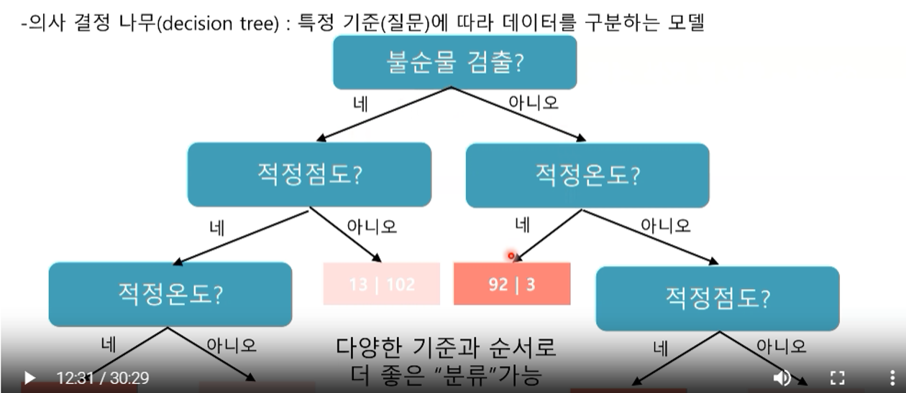
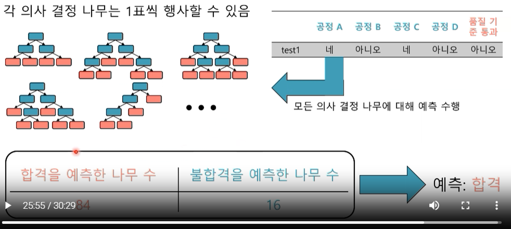

# 머신러닝 분류 모델: 의사결정나무 & 랜덤포레스트

## 개요

### 의사결정나무 (Decision Tree)
의사결정나무는 데이터를 트리 구조로 분할하여 예측 또는 분류를 수행하는 지도 학습 알고리즘입니다[1]. 각 노드는 데이터의 특정 특징에 따라 분기하며, 최종 리프 노드에서 예측 결과를 제공합니다.

- **노드 분할 기준**: Gini 지수, 엔트로피, 카이제곱 등을 사용하여 데이터를 분할합니다[1].
- **과적합 방지**: 
  - 가지치기(pruning)
  - 최대 깊이 설정
  - 최소 샘플 수 설정
- **장점**:
  - 해석이 쉬움 (결과를 트리 구조로 시각화 가능)
  - 범주형 및 연속형 데이터 모두 처리 가능
- **단점**:
  - 과적합(overfitting) 위험이 있음
  - 데이터에 민감하여, 작은 변화에도 트리가 크게 변할 수 있음

### 랜덤포레스트 (Random Forest)
랜덤포레스트는 여러 개의 의사결정나무를 결합하여 예측력을 향상시키는 앙상블 학습 기법입니다[2]. 각 트리는 데이터의 무작위 샘플링과 특징 선택을 통해 독립적으로 학습됩니다.

- **Bootstrap Aggregation**: 데이터의 부트스트랩 샘플링을 통해 각 트리를 학습합니다[2].
- **무작위성 도입**:
  - 각 노드에서 무작위로 선택된 일부 특징을 사용하여 분할합니다.
- **앙상블 예측**:
  - 분류 문제: 다수결 투표(voting)
  - 회귀 문제: 평균(averaging)
- **장점**:
  - 과적합 방지
  - 높은 예측 정확도
  - 이상치 및 노이즈에 강건함
- **단점**:
  - 학습 속도가 느릴 수 있음
  - 개별 트리의 해석이 어려움

## 알고리즘 개념

### 1. 엔트로피
- **정의**: 무작위로 선택한 데이터 집합에서의 불확실성을 나타내는 지표입니다[3].
- **계산**: 엔트로피는 다음 공식으로 계산됩니다: $$ H = -\sum_{i=1}^{n} p_i \log_2(p_i) $$[3].
- **특징**: 엔트로피가 낮을수록 데이터의 순도가 높고, 분류가 잘 되었음을 의미합니다.

### 2. Gini 지수
- **정의**: 무작위로 선택한 데이터 집합에서 잘못 분류될 확률을 나타내는 지표입니다[4].
- **계산**: Gini 지수는 다음 공식으로 계산됩니다: $$ G = 1 - \sum_{i=1}^{n} p_i^2 $$[4].
- **특징**: Gini 지수가 낮을수록 데이터의 순도가 높고, 분류가 잘 되었음을 의미합니다.

### 3. 카이제곱 검정
- **정의**: 두 범주형 변수 사이의 독립성 여부를 검정하는 통계적 방법입니다[5].
- **계산**: 카이제곱 통계량은 다음 공식으로 계산됩니다: $$ \chi^2 = \sum \frac{(O_i - E_i)^2}{E_i} $$[5].
- **특징**: 관찰된 빈도와 기대 빈도의 차이를 측정하여 변수 간 관계를 평가합니다.

### 4. 부트스트랩 샘플링
- **정의**: 복원 추출을 통해 데이터 집합을 샘플링하는 방법입니다[6].
- **과정**: 
  1. 원본 데이터셋에서 무작위로 샘플을 선택합니다.
  2. 선택된 샘플을 새로운 데이터셋에 추가합니다.
  3. 선택된 샘플을 원본 데이터셋에 다시 넣습니다 (복원).
  4. 원하는 샘플 크기에 도달할 때까지 1-3 단계를 반복합니다[6].
- **특징**: 랜덤포레스트에서 각 트리를 학습할 때 사용되며, 모델의 다양성을 증가시켜 과적합을 방지합니다.

이러한 알고리즘 개념들은 의사결정나무와 랜덤포레스트의 핵심 구성 요소로, 데이터 분할, 특징 선택, 그리고 모델 평가에 중요한 역할을 합니다.

Citations:
[1] https://www.shiksha.com/online-courses/articles/understanding-decision-tree-algorithm-in-machine-learning/
[2] https://careerfoundry.com/en/blog/data-analytics/what-is-random-forest/
[3] https://sciencenotes.org/what-is-entropy-definition-and-examples/
[4] https://en.wikipedia.org/wiki/Gini_coefficient
[5] https://datatab.net/tutorial/chi-square-test
[6] https://datasciencedojo.com/blog/bootstrap-sampling/