# 딥러닝

딥러닝(Deep Learning)은 인공 신경망(Artificial Neural Network)을 기반으로 한 기계 학습의 한 분야입니다. 딥러닝은 다층 신경망을 사용하여 데이터로부터 특징을 자동으로 학습하고, 이를 통해 예측, 분류, 생성 등의 다양한 작업을 수행할 수 있습니다.

## 인공 신경망(Neural Network)

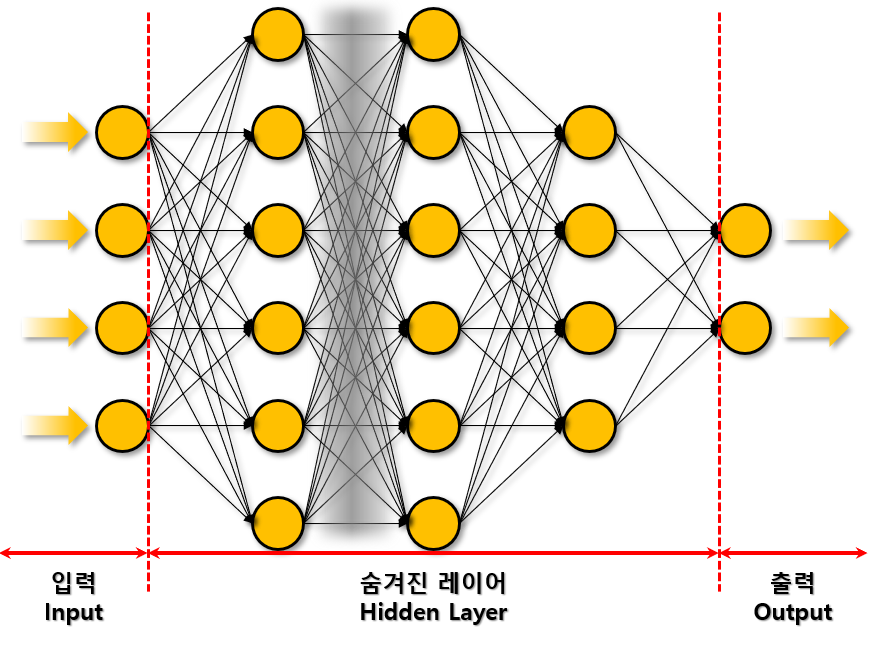

인공 신경망은 생물학적 신경망을 모방하여 설계된 모델로, 다수의 뉴런(Neuron)으로 구성되어 있습니다. 인공 신경망은 입력층(Input Layer), 은닉층(Hidden Layer), 출력층(Output Layer)으로 구성되어 있으며, 퍼셉트론이 기본 요소로써 여러개의 층을 쌓아 다층 신경망을 구성할 수 있습니다.

## 퍼셉트론(Perceptron)
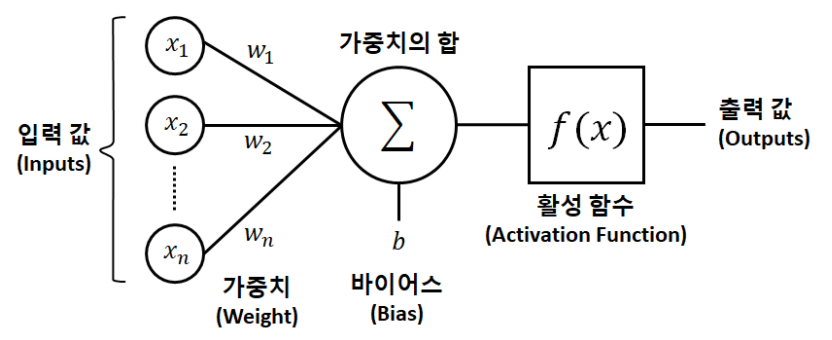

퍼셉트론은 다수의 입력을 받아 가중합을 계산한 뒤, 활성화 함수를 적용하여 출력을 반환하는 모델입니다.

$$
y = f(\sum_{i=1}^{n} w_i x_i + b)
$$

- 가중치(Weight): 입력 값에 곱해지는 계수로, 각 입력 값이 결과에 미치는 영향을 조절하는 역할을 합니다.

- 편향(Bias): 입력 값에 더해지는 계수로, 가중합에 더해져 활성화 함수의 입력으로 사용됩니다.

- 활성화 함수(Activation Function): 가중합을 입력으로 받아 출력을 계산하는 함수로, 비선형 함수를 사용하여 신경망이 복잡한 함수를 근사할 수 있도록 합니다.

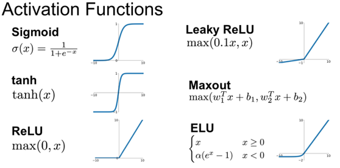

## 딥러닝의 과정

신경망의 학습은 순전파(Forward Propagation)와 역전파(Backward Propagation)를 반복하여 수행됩니다. 순전파는 입력값이 신경망을 통과하여 출력값을 계산하는 과정을 의미하며, 역전파는 손실함수의 값이 최소가 되도록 가중치와 편향을 조정하는 과정을 의미합니다. 순전파를 통해 예측값을 계산하고, 실제값과 비교하여 손실함수의 값을 계산한 뒤, 역전파를 통해 가중치와 편향을 조정하여 모델을 학습시킵니다.

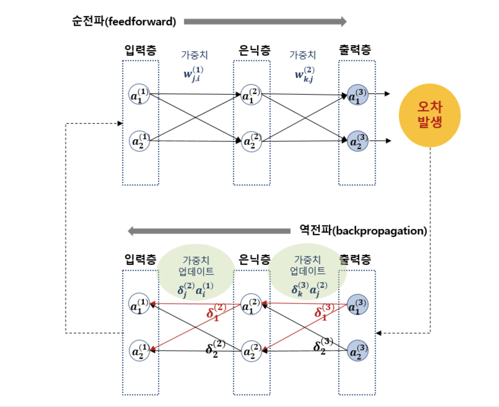

- 손실함수(Loss Function): 신경망의 출력값과 실제값의 차이를 계산하는 함수로, 신경망의 성능을 평가하는 지표로 사용됩니다. 손실함수의 값이 작을수록 신경망의 성능이 좋다고 할 수 있습니다.

  - 평균 제곱 오차(Mean Squared Error, MSE):
  $
  MSE = \frac{1}{n} \sum_{i=1}^{n} (y_i - \hat{y_i})^2
  $

  - 교차 엔트로피 오차(Cross Entropy Error):
  $
  CEE = -\sum_{i=1}^{n} y_i \log(\hat{y_i})
  $

- 옵티마이저(Optimizer): 손실함수의 값이 최소가 되도록 가중치와 편향을 조정하는 알고리즘으로, 경사하강법(Gradient Descent)이 널리 사용됩니다.

  - 경사하강법(Gradient Descent):
  $
  \theta_{t+1} = \theta_t - \eta \nabla f(\theta_t)
  $

  - 확률적 경사하강법(Stochastic Gradient Descent, SGD)
  - 모멘텀(Momentum)
  - 아다그라드(Adagrad)
  - 알엠에스프롭(RMSprop)
  - 아담(Adam)

- 배치(Batch): 학습 데이터를 나누어 한 번에 처리하는 데이터의 양으로, 전체 데이터를 한 번에 처리하는 것보다 메모리 사용량을 줄이고 학습 속도를 높일 수 있습니다.

- 에포크(Epoch): 전체 데이터를 한 번 학습하는 과정을 의미하며, 학습 데이터를 여러 번 반복하여 학습하는 것이 일반적입니다.

- 드롭아웃(Dropout): 학습 과정에서 신경망의 일부 뉴런을 무작위로 제거하는 방법으로, 과적합을 방지하고 모델의 일반화 성능을 향상시킬 수 있습니다.

- 과소적합과 과대적합(Underfitting and Overfitting): 과소적합은 모델이 학습 데이터를 충분히 학습하지 못하는 경우를 의미하며, 과대적합은 학습 데이터에만 잘 맞는 모델이 새로운 데이터에 대해 일반화 성능이 떨어지는 경우를 의미합니다.

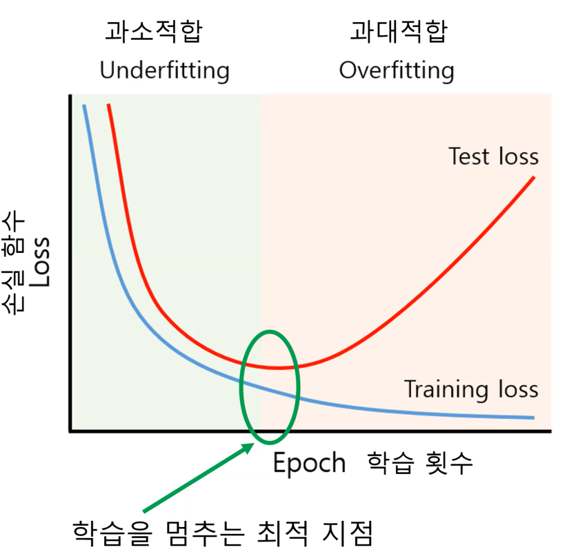

## 딥러닝의 종류

- 합성곱 신경망(Convolutional Neural Network, CNN): 입력값들 사이에 관계가 있을때 주로 사용되며, 합성곱층(Convolutional Layer)과 풀링층(Pooling Layer)으로 구성되어 있습니다. 이미지 관련 작업에 주로 사용되며, 이미지 분류, 객체 검출, 분할 등의 작업에 활용됩니다.
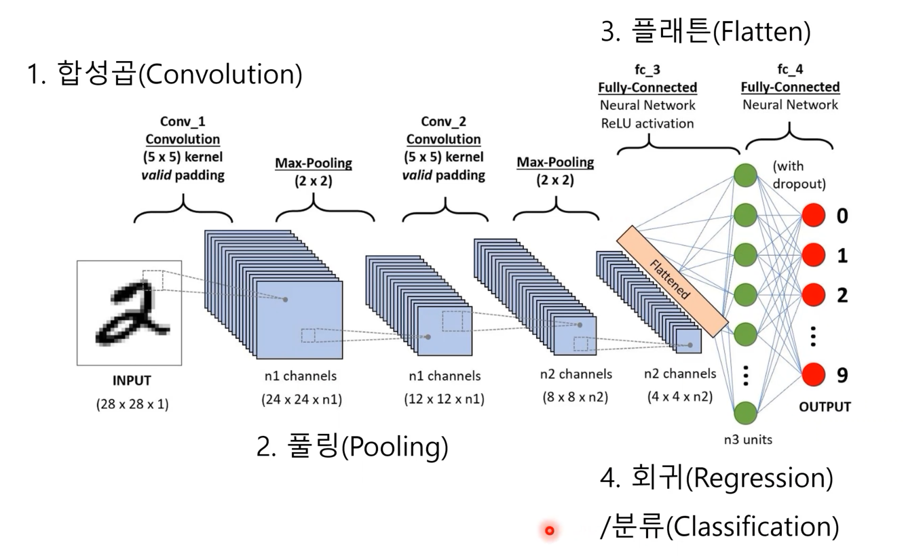
  - 합성곱층(Convolutional Layer): 입력값에 필터를 적용하여 특징을 추출하는 층으로, 이미지의 특징을 추출하는 역할을 합니다.
  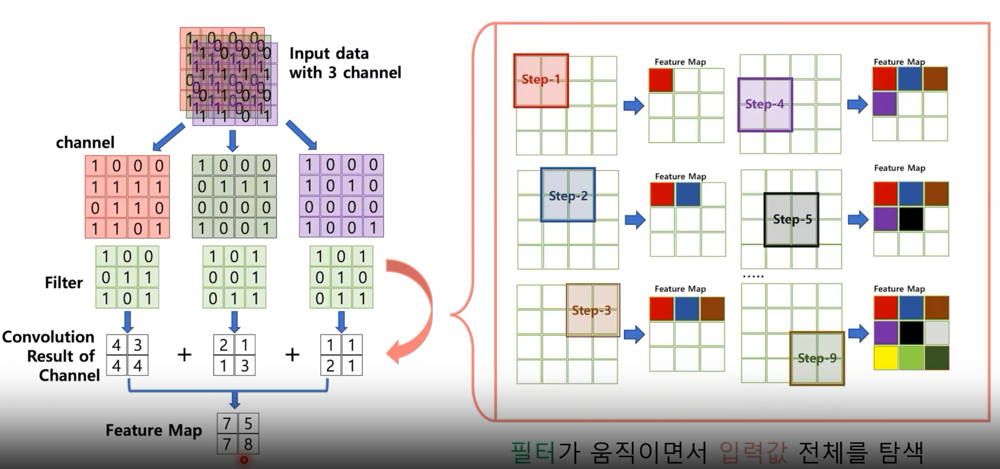
  - 풀링층(Pooling Layer): 합성곱층의 출력값을 축소하는 층으로, 계산량을 줄이고 과적합을 방지하는 역할을 합니다.
  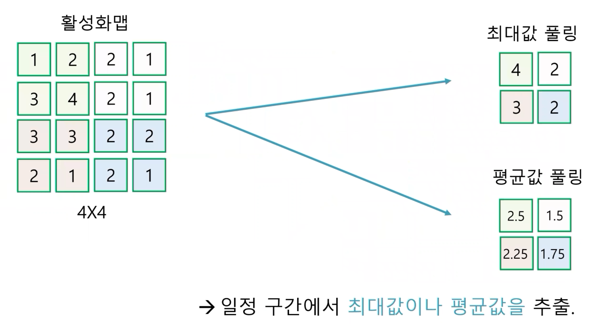
  - 플래튼층(Flatten Layer): 다차원 배열을 1차원 배열로 변환하는 층으로, 합성곱층과 완전연결층 사이에 배치됩니다.
  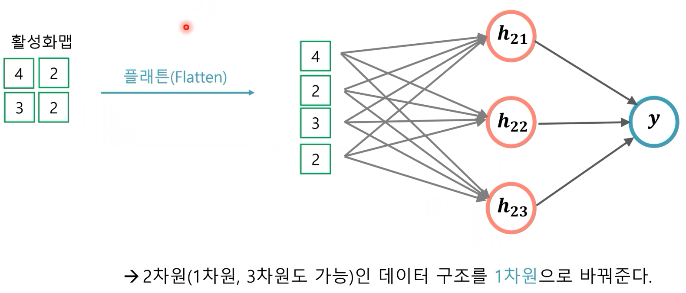

- 순환 신경망(Recurrent Neural Network, RNN): 입력값과 출력값이 시퀀스(Sequence) 형태로 구성되어 있는 작업에 주로 사용되며, 순환층(Recurrent Layer)으로 구성되어 있습니다. 시계열 데이터 분석 작업에 활용됩니다.
  - 일반 RNN (RNN): 순환층의 출력값을 다음 시간 단계의 입력값으로 사용하는 구조로, 이전 단계의 정보가 다음 단계의 입력값에 영향을 미치게끔 설계되어 있습니다. 하지만, 시간이 지남에 따라 기울기가 소실되어 과거 입력값이 현재 출력값에 영향을 미치지 못하는 문제가 있습니다.
  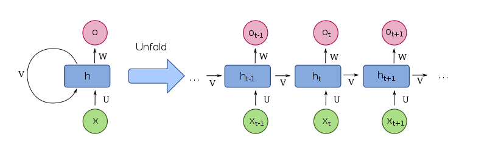

  - 장단기 메모리(LSTM, Long Short-Term Memory): RNN의 기울기 소실 문제를 해결하기 위해 제안된 모델로, 입력 게이트(Input Gate), 삭제 게이트(Forget Gate), 출력 게이트(Output Gate)로 구성되어 있습니다.
  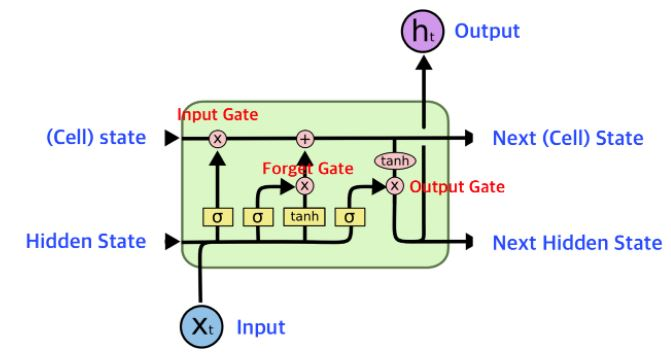

- 오토인코더(Autoencoder, AE): 입력값과 출력값이 동일한 작업에 주로 사용되며, 인코더(Encoder)와 디코더(Decoder)로 구성되어 있습니다. 입력값을 저차원으로 압축한 뒤, 다시 복원하는 과정을 통해 입력값을 재구성하는 방법으로, 데이터의 특징을 추출하거나 노이즈 제거 또는 이상탐지에도 사용됩니다.

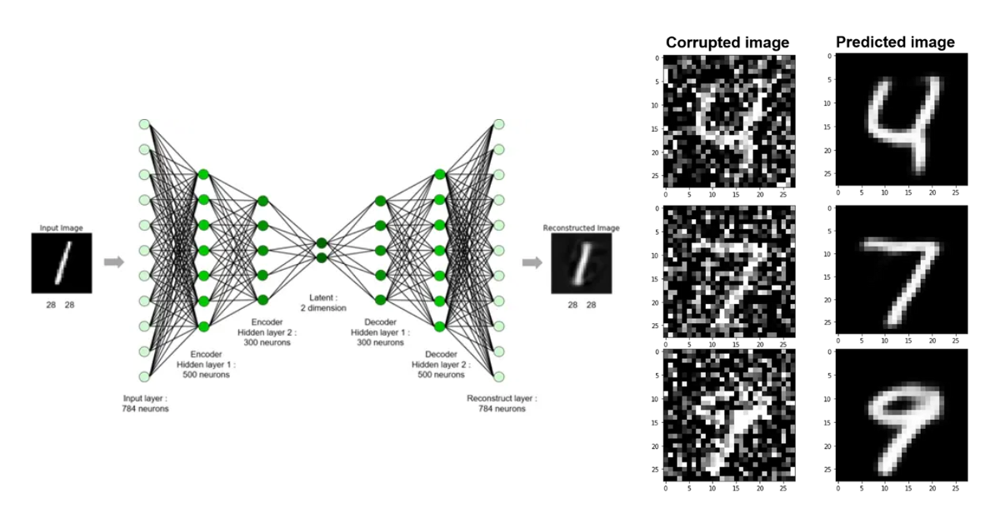
  - 인코더(Encoder): 입력값을 저차원으로 압축하는 역할을 합니다.
  - 디코더(Decoder): 인코더에서 압축된 정보를 복원하는 역할을 합니다.

- 트랜스포머(Transformer): 어텐션(Attention) 메커니즘을 사용하여 시퀀스 데이터를 처리하는 모델로, RNN과 CNN의 단점을 보완하고, 병렬 처리가 가능하여 학습 속도를 높일 수 있습니다. 자연어 처리 작업에 주로 사용되며, 번역, 요약, 질문 응답 등의 작업에 활용됩니다.
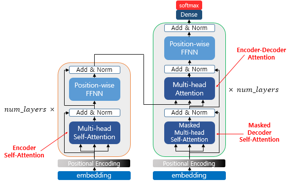

  - 참조(Reference): 
    1. [Attention is All You Need](https://arxiv.org/abs/1706.03762)
    2. [The Illustrated Transformer](http://jalammar.github.io/illustrated-transformer/)
    3. [한국어 교육자료](https://wikidocs.net/31379)

## 딥러닝 프레임워크

- 텐서플로(TensorFlow): 구글에서 개발한 오픈소스 딥러닝 프레임워크로, 산업 및 연구에서 널리 사용되고 있습니다.
- 케라스(Keras): 딥러닝 모델을 쉽게 구축하고 훈련할 수 있는 고수준 딥러닝 API로, 텐서플로, 씨아노(Theano), CNTK 등의 백엔드 엔진을 사용할 수 있습니다.
- 파이토치(PyTorch): 페이스북에서 개발한 오픈소스 딥러닝 프레임워크로, 동적 계산 그래프(Dynamic Computational Graph)를 지원하여 파이썬과 함께 사용하기 용이합니다.
