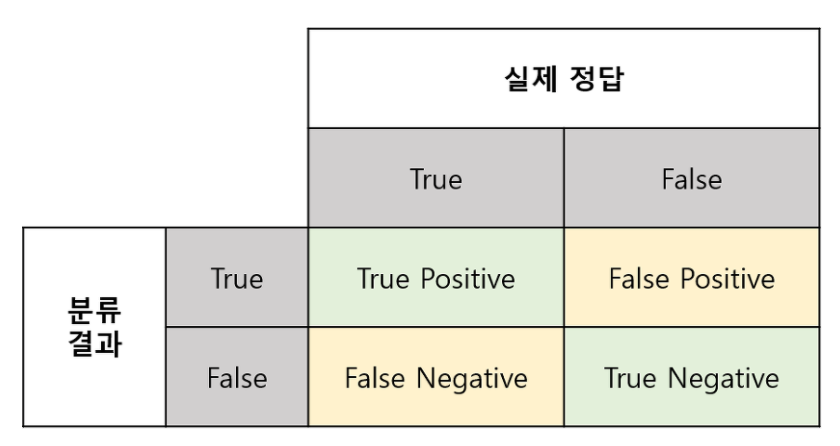

# 머신러닝 성능 평가 지표

머신러닝 모델의 성능을 평가하는 것은 모델 개발과 개선에 매우 중요합니다. 주요 성능 평가 지표는 다음과 같습니다:

## 분류 모델 평가 지표

### 혼동 행렬 (Confusion Matrix)
혼동 행렬은 분류 모델의 성능을 시각화하는 기본적인 도구입니다[1][4].

- **정의**: 분류 모델의 예측 결과를 실제 값과 비교하여 2차원 행렬 형태로 표현한 것
- 구성 요소:
  - **TP(True Positive)**: 실제 값이 Positive, 예측 값이 Positive인 경우
  - **TN(True Negative)**: 실제 값이 Negative, 예측 값이 Negative인 경우
  - **FP(False Positive)**: 실제 값이 Negative인데 예측 값이 Positive인 경우
  - **FN(False Negative)**: 실제 값이 Positive인데 예측 값이 Negative인 경우
- 활용: 모델 예측 결과의 상세 이해 및 Precision, Recall, F1-score 등 다른 지표 계산의 기초 자료로 사용

### 정확도 (Accuracy)
- **정의**: 전체 예측 중 정답을 맞힌 비율
- **계산식**:  
  \[
  \text{Accuracy} = \frac{TP + TN}{TP + TN + FP + FN}
  \]
- **특징**: 클래스 불균형(Class Imbalance)에 취약함. 즉, 특정 클래스가 매우 많을 경우 단순 정확도는 높은 값을 나타낼 수 있지만 실제 모델 품질은 낮을 수 있음.

### 정밀도 (Precision)
- **정의**: 모델이 Positive로 예측한 것 중 실제로 Positive인 비율
- **계산식**:  
  \[
  \text{Precision} = \frac{TP}{TP + FP}
  \]
- **특징**: FP를 줄이는 데 집중한 지표로, False Alarm을 최소화해야 하는 상황(예: 스팸 필터)에서 중요.

### 재현율 (Recall)
- **정의**: 실제 Positive 중 모델이 Positive로 잘 잡아낸 비율
- **계산식**:  
  \[
  \text{Recall} = \frac{TP}{TP + FN}
  \]
- **특징**: FN을 줄이는 데 집중한 지표로, 실제 양성 사례를 놓치지 않는 것이 중요한 상황(예: 질병 진단)에서 중요.

### F1 점수
- **정의**: Precision과 Recall의 조화평균(Harmonic Mean)
- **계산식**:  
  \[
  F1 = 2 \times \frac{\text{Precision} \times \text{Recall}}{\text{Precision} + \text{Recall}}
  \]
- **특징**: Precision과 Recall 사이의 균형점을 찾아주는 지표로, 클래스 불균형 상황에서 Accuracy 대신 사용하기 좋음.

### ROC 곡선(ROC Curve) 및 AUC(Area Under the Curve)
- **ROC 곡선**: 모델의 모든 가능한 분류 기준(Threshold)에 대해 TPR(True Positive Rate)와 FPR(False Positive Rate)를 나타낸 곡선
  - **TPR(=Recall)**: \(\frac{TP}{TP+FN}\)
  - **FPR**: \(\frac{FP}{FP+TN}\)
- **AUC**: ROC 곡선 아래 면적
  - 1에 가까울수록 우수한 성능
  - 클래스 불균형 상황에서 모델 비교에 유용

### 정밀도-재현율(PR) 곡선(Precision-Recall Curve) 및 AP(Average Precision)
- **PR 곡선**: Threshold 변화에 따른 Precision과 Recall의 변화를 나타낸 곡선
- **AP(Average Precision)**: PR 곡선 아래 면적으로, 특히 클래스 불균형이 심한 문제에서 ROC-AUC 대신 자주 사용

## 회귀 모델 평가 지표

### 결정 계수 (R², R-squared)

예측값이 실제값을 얼마나 잘 설명하는지 나타내는 지표입니다[6][8].
$$ R^2 = 1 - \frac{\sum_{i=1}^{n} (y_i - \hat{y}_i)^2}{\sum_{i=1}^{n} (y_i - \bar{y})^2} $$

### 평균 절대 오차 (MAE, Mean Absolute Error)

예측값과 실제값의 차이의 절대값 평균입니다[6][8].

$$ \text{MAE} = \frac{1}{n} \sum_{i=1}^{n} |y_i - \hat{y}_i| $$

### 평균 제곱 오차 (MSE, Mean Squared Error)

예측값과 실제값 차이의 제곱의 평균입니다[6][8].

$$ \text{MSE} = \frac{1}{n} \sum_{i=1}^{n} (y_i - \hat{y}_i)^2 $$

### 제곱근 평균 제곱 오차 (RMSE, Root Mean Squared Error)

MSE의 제곱근으로, 예측의 표준편차를 나타냅니다[6][8].

$$ \text{RMSE} = \sqrt{\frac{1}{n} \sum_{i=1}^{n} (y_i - \hat{y}_i)^2} $$

Citations:
[1] https://codingsmu.tistory.com/88
[2] https://deeppago.tistory.com/79
[3] https://www.javatpoint.com/performance-metrics-in-machine-learning
[4] https://tnqkrdmssjan.tistory.com/116
[5] https://velog.io/@crescent702/%EB%B2%88%EC%97%AD-Evaluation-Metrics-for-Machine-Learning-Models
[6] https://www.v7labs.com/blog/performance-metrics-in-machine-learning
[7] https://www.purestorage.com/kr/knowledge/machine-learning-performance-metrics.html
[8] https://www.geeksforgeeks.org/metrics-for-machine-learning-model/